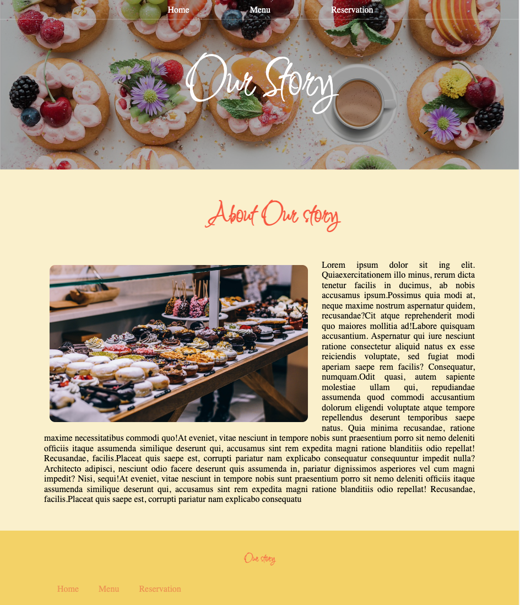

# Bakery website

### This website is a part of Odin project’s curriculum and servers as an example project for my personal web development portfolio. 

Bakery website lets users inform themself about bakery's offers, as well as option of reserving a table. 

## Build with:

- HTML 5
- CSS 3
- Java script

*View and interact with the project [here](https://maarbay.github.io/project-bakery-website/index.html)*

This application is built to showcase my understanding of Java Script, alongside the ability to implement CSS and HTML. 

